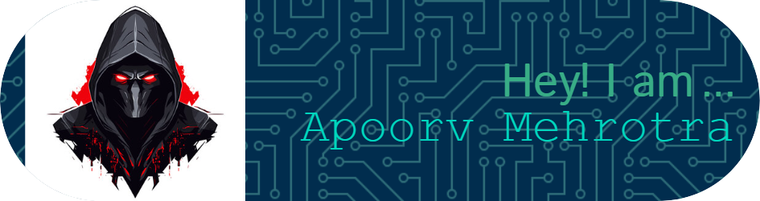

<!-- Header Image -->

  

<!-- Rocket Image -->

  

<!-- Cool Animation GIF -->

  

<!-- Typing Animation -->

  

<!-- About Me Section -->

  
Hey there! I'm Apoorv Mehrotra👋
  
🚀 About Me

- 🎓 Currently pursuing a BTech in Computer Science and Engineering with a specialization in AI, ML, and IoT.
- 🎯 Aspiring to become a Data Scientist.
- 🎮 Passionate about playing and creating mobile games.
- 🌐 Active in the best coding communities, constantly learning and growing.
  
🛠️ Skills

Languages:

- ☕ Java
- 🐍 Python
- 🌐 JavaScript
- 💻 C++
  
Technologies:

- 🔥 PyTorch
- 🌍 Node.js
- ⚛️ React
  
Tools:

- 🛠️ Git
- 🚀 Vercel
  
🌐 I love to connect with the awesome coding communities ❤️🧑🏻‍💻

📫 Get in Touch:

- 📧 Email: codeguy2024@gmail.com
- 💼 LinkedIn: [Apoorv Mehrotra](https://www.linkedin.com/in/apoorv-mehrotra-089947288/)
- 📸 Instagram: [unique.overload_happiness](https://www.instagram.com/unique.overload_happiness/?hl=en)
- 💻 LeetCode: [APOORVMEHROTRA1](https://leetcode.com/u/APOORVMEHROTRA1/)
  
🎉 Fun Facts:

- 🎮 I spend my free time diving into the latest mobile games.
- 🕹️ I love creating unique and exciting games for mobile platforms.

<!-- GitHub Stats and Cool GIF Section -->

  <table style="background-color: orange" border="1">
    <tr>
      <td align="left">
        
      </td>
      <td align="right">
        
      </td>
    </tr>
  </table>

<!-- Music Section with Link -->

  🎶 [Listen to music while you explore my profile!](https://open.spotify.com/track/{TRACK_ID}) 🎶

<!-- SVG Wave Animation Footer -->

  

